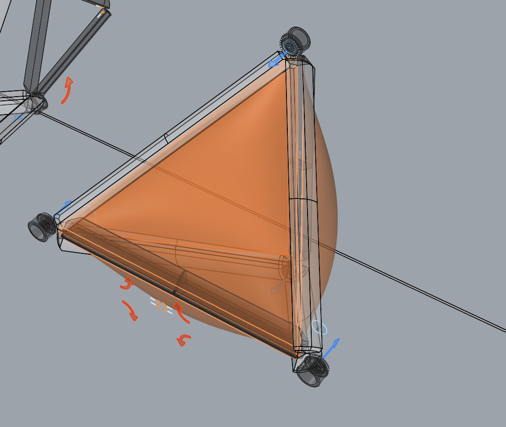
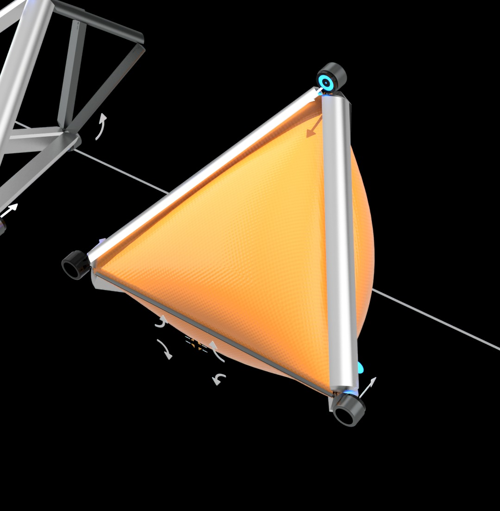
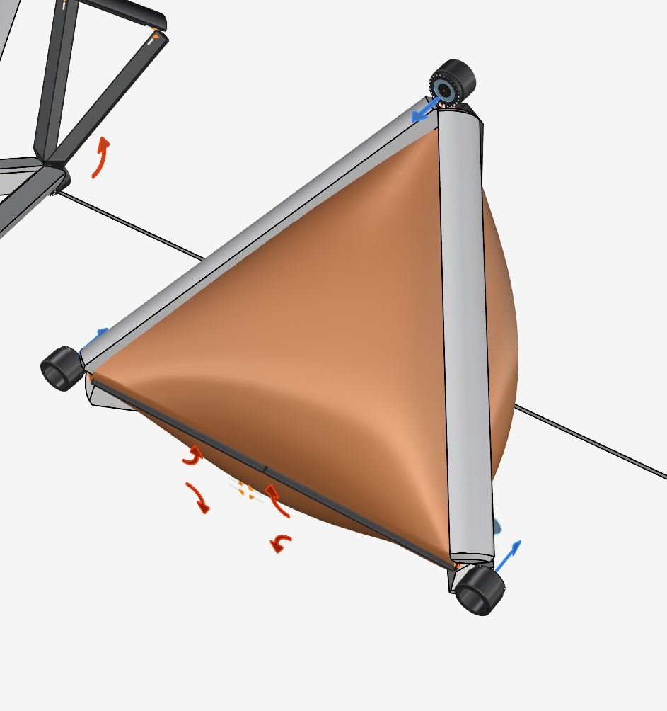

# F.R.O.G. – Feasible Remediation Orbital Gatherer

The Feasible Remediation Orbital Gatherer (F.R.O.G.) is a specialized spacecraft designed to address the issue of space debris. It operates by actively collecting and removing orbital junk, thereby contributing to the restoration of a safer and more sustainable space environment.

This innovative solution focuses on the remediation process, which involves correcting and cleaning up problems in space, similar to environmental cleanup efforts on Earth.

F.R.O.G. represents a practical approach to tackling the growing challenge of space debris, ensuring that Earth's orbit remains clear and functional for future space activities.

## FROG Concept: Capturing Debris Like a Frog Catches a Fly

FROG does not rely on traditional robotic arms. Instead, it envelops space debris much like a frog catching a fly, ensuring effective capture even for high-speed, rotating debris.

Key Components of FROG’s Debris Capture and Deorbiting System:

## 1. Enveloping Mechanism

-   Instead of mechanical grasping, FROG surrounds debris, creating a controlled internal space for stabilization.
-   This method allows for safer handling of fast-spinning or irregularly shaped debris.

## 2. Krypton-Based Energy Dissipation & Recapture

-   Krypton gas, sourced from ion propulsion engines (like those on Starlink spacecraft), is released inside FROG.
-   The gas dissipates the kinetic energy of the debris, slowing it down.
-   A pump then recaptures the krypton, returning it to chambers for reuse in propulsion, creating a closed-loop system for efficiency.

## 3. Folding Mechanism for Krypton Recapture

-   FROG is foldable, allowing for an adjustable internal volume.
-   After capturing debris, reducing the inner space increases krypton pressure, making it easier to pump back into storage.
-   This ensures minimal loss of propellant while maximizing energy dissipation.

## 4. Video Monitoring System

-   At least two cameras will be used:
-   One inside to observe the debris as it is enveloped.
-   One outside to provide an overall view of the capture process.
-   This will allow an operator to monitor the process in real time, ensuring efficiency and safety.

## 5. Active Folding Control & Sensor Integration

-   The folding mechanism will be actively controlled, adapting to different debris sizes.
-   Sensors will monitor krypton pressure and flow, optimizing gas recapture and usage.

## Images

